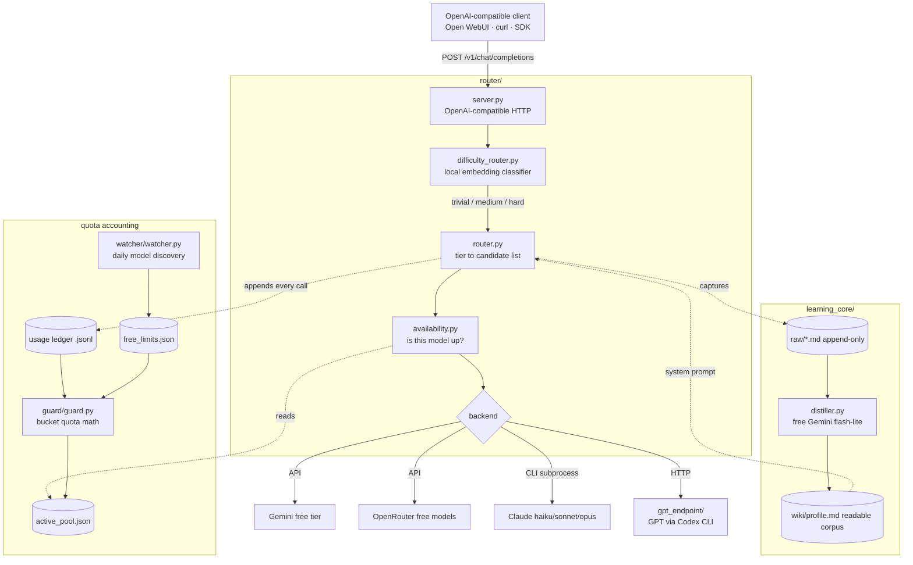

# AI Router

A self-hosted LLM router. It classifies every incoming request by **difficulty**,
picks the cheapest model that can still answer it well, and serves the result over
an **OpenAI-compatible HTTP API** — so any OpenAI client (Open WebUI, a plain
`curl`, an SDK) can point at it without knowing any of this is happening.

Around it: a quota **guard** that keeps the free tiers from running dry, a
**watcher** that discovers newly-free models, and a **learning core** that distils
conversations into a readable profile the router injects back as context.

Runs on a home Arch server. Everything on free tiers or an existing subscription —
that is a hard project constraint, not an accident (see [`CONSTITUTION.md`](CONSTITUTION.md)).

~5,000 lines of Python across 8 services.

---

## Why

Sending "what time is it" to a frontier model is a waste; sending "design a
distributed rate limiter" to a small one is worse. Most routing products solve this
with another LLM call, which spends a model call to decide which model to call.
This does the classification **locally, with sentence embeddings, in ~30 ms and
zero API calls**.

---

## Architecture



---

## The parts

### 1. Difficulty classifier — `router/difficulty_router.py`

Three fixed tiers (trivial / medium / hard), seeded with example utterances in
**Czech and English in one embedding space**, encoded with
`paraphrase-multilingual-MiniLM-L12-v2` via FastEmbed. A query is embedded once and
cosine-matched against the seeds. No LLM call, no network, ~30 ms.

The interesting decision is **what to do when it is unsure**. The error cost is
asymmetric: misrouting *down* gives a bad answer with no safety net, misrouting *up*
only wastes quota. So the classifier commits to `trivial` or `hard` only when it is
confident (top score >= 0.45, or >= 0.15 clear of the runner-up) and **otherwise
defaults to `medium`** — the tier that can escalate on its own.

It is also deliberately **model-agnostic**: it knows nothing about model names, so
the whole model lineup can change without retouching the classifier.

### 2. Tier to model, with rotation — `router/router.py`

Each tier maps to an ordered **candidate list**, not a single model. The router takes
the first *available* one and rotates down the list on a 429. A message can also skip
the classifier entirely with an explicit prefix (`opus: ...`, `@gemini ...`).

The comments in this file are a log of measured tradeoffs rather than intentions:

- time-to-first-token, measured: `gemini-flash-lite` 0.61 s vs `gemini-flash` 4.17 s;
  the Claude CLI path costs ~5.5 s cold — and **Haiku is no faster than Opus there,
  because the tax is process startup, not model size**.
- so the medium tier once led with fast Gemini, then deliberately switched to Sonnet,
  accepting ~5 s instead of ~0.6 s, because in practice trivial and medium were
  landing on the *same* model and the tier distinction bought nothing. The superseded
  measurement is kept in the file, because it is still true and it is the price that
  decision pays.
- requests **carrying tools** never reach the CLI backends: they silently drop tool
  calls, so `supports_tools()` filters them out of the candidate list.
- a quota-separation scheme is annotated `UNVERIFIED` where it is — Gemini quotas are
  per *project*, not per key, and that was never confirmed.

### 3. Quota guard — `guard/guard.py`

The router does **no quota math**. A separate always-on guard owns availability:

- it **never polls a provider** — it self-accounts from the services' own append-only
  call ledgers (free, exact, and it cannot be rate-limited for asking),
- limit rules are **buckets** matched by glob (`openrouter/*:free` -> rpm 20, rpd 50),
  so every model sharing a quota draws from one counter,
- it drops a model when its window is spent and restores it when the window rolls,
- **one writer per ledger file**, because those files cross machines over Syncthing
  and two writers would produce conflict copies.

stdlib only, no network, no keys.

### 4. Model watcher — `watcher/watcher.py`

Runs daily, discovers what is currently free on OpenRouter and what its limits are,
and writes the *rules* the guard reads. `router/pool.py` then curates that raw list
(15-400 models) down to a handful **by rule, not by hand** — drop non-chat and
moderation models, require a plausible parameter count, sort, keep the top N — so it
keeps working on a model lineup that did not exist when it was written.

Per the constitution, the watcher may never switch to a paid model on its own.

### 5. Learning core — `learning_core/`

A three-layer corpus in the spirit of Karpathy's LLM-maintained wiki:

```
raw/    append-only conversation log     <- what happened
wiki/   distilled profile.md             <- what was learned  (source of truth)
schema/ distillation rules               <- how to fold one into the other
```

`capture.py` exports new exchanges from the agent's SQLite store; `distiller.py` folds
them into `profile.md` using free Gemini flash-lite; `router/persona.py` injects that
profile into the system prompt. Idempotent via byte offsets, backs up before every
rewrite, refuses to overwrite on empty or suspicious model output, and no-ops below
200 new characters so idle runs cost nothing.

The point is that the corpus is **readable markdown you can open and correct**, not an
opaque memory blob inside an agent.

### 6. Supporting services

| | |
|---|---|
| `gpt_endpoint/` | GPT over an existing Codex CLI subscription, behind a small HTTP shim |
| `mcp_fs/` | MCP filesystem server — scoped file access for the agent |
| `stt_endpoint/` | speech-to-text endpoint for the web UI |

---

## Running it

```bash
pip install litellm semantic-router fastembed numpy

export GEMINI_API_KEY=...          # or put it in router/.api_key
export AI_ROUTER_PORT=8081

python router/server.py            # OpenAI-compatible API
python guard/guard.py              # quota guard, separate process
```

```bash
curl localhost:8081/v1/chat/completions \
  -H 'Content-Type: application/json' \
  -d '{"messages":[{"role":"user","content":"kolik je 15 + 27"}]}'
```

Classifier only, no server:

```bash
python router/difficulty_router.py   # routes a fixed CZ/EN test set, prints tier + timing
```

systemd units for every long-running piece sit next to their service.

---

## Notes

- **Inline comments and docstrings are in Czech.** This is a personal system that ran
  in production for its own author; those comments are the real decision log, and I
  kept them verbatim rather than retranslating them after the fact. The README, the
  constitution and this description are in English.
- **This repo is a sanitized export.** The private tree also holds the learned personal
  profile, raw conversation logs, usage ledgers, deployment notes and host addresses;
  none of that is here. No credentials were ever committed — keys are read from the
  environment or from a gitignored file.
- **Built with AI pair-programming (Claude Code)**, across two machines: a Windows
  session and an Arch session working the same Syncthing-shared tree, coordinating
  through an append-only message file with a strict file-ownership protocol. The
  architecture and the decisions are mine, and I can defend every one of them.
- **Status: working, and still moving.** It serves a real Open WebUI daily. Some of the
  sharper comments in the code describe things it still gets wrong.
